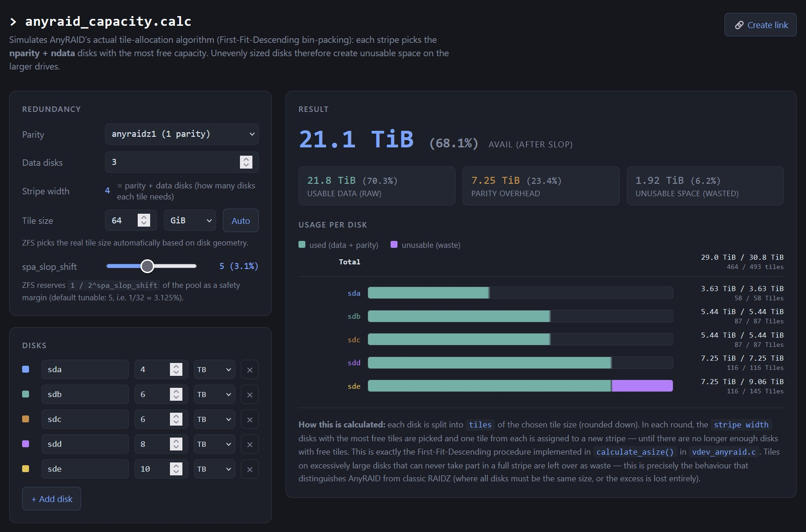

# AnyRAID Capacity Calculator

This is a small, html-based calculator that simulates the tile-allocation algorithm used by the upcoming **OpenZFS AnyRAID** to estimate the usable pool capacity.

This repo includes two variants:
- **[Single Layout Calculator](https://gendra13.github.io/anyraid-calc/anyraid_calc.html)** — configure an AnyRAID vdev and calculate the usable capacity, parity overhead, wasted space, and per-disk tile usage.
- **[Compare Calculator](https://gendra13.github.io/anyraid-calc/anyraid_calc-compare.html)** — shows two disk-layouts side by side and compares the usable capacity directly.

These calculators should cover most edge cases, however I cannot guarantee their correctness, so keep that in mind when planning (or buying) our rig.

  

## ⚠️ Important note:

At the current time AnyRAID is not yet part of a stable OpenZFS release. These calculators were based on the current pull requests [`openzfs/zfs` PR #17567](https://github.com/openzfs/zfs/pull/17567) and [`openzfs/zfs` PR #18406](https://github.com/openzfs/zfs/pull/18406) (`KlaraSystems:anyraid`), which are still under review, so things might change until the final release.

## Disclaimer

These calculators were built by reading and testing the AnyRAID implementation in the mentioned PRs. This repo is just an independent, unofficial planning tool and not related in any way to Klara Systems or the ZFS developers.

All credit for the actual AnyRAID feature goes to its authors (https://klarasystems.com/). 
